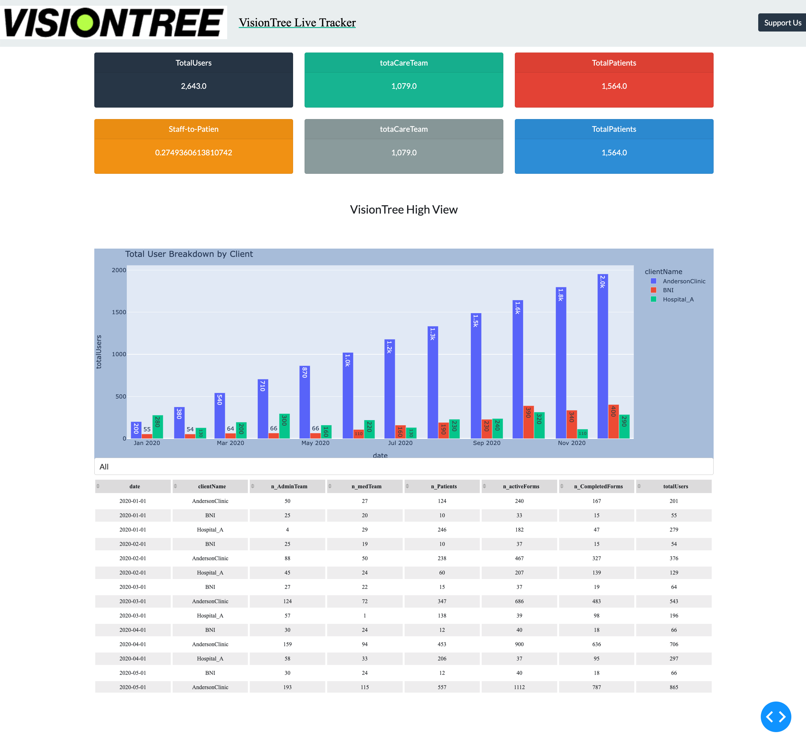

[] 

#  Dash Application 

This is a boilerplate code for creating the dashboard as seen in the pic above... 

## How to Run 

1. Clone the repository 


```

2. Install dependencies 

```
pip install -r requirements.txt
```

3. Run the application 

```
python app.py
```